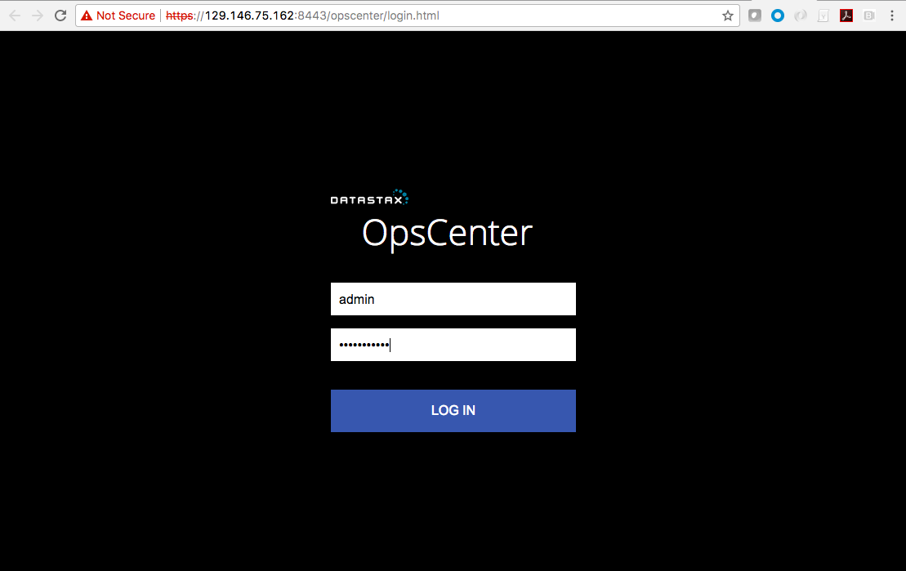
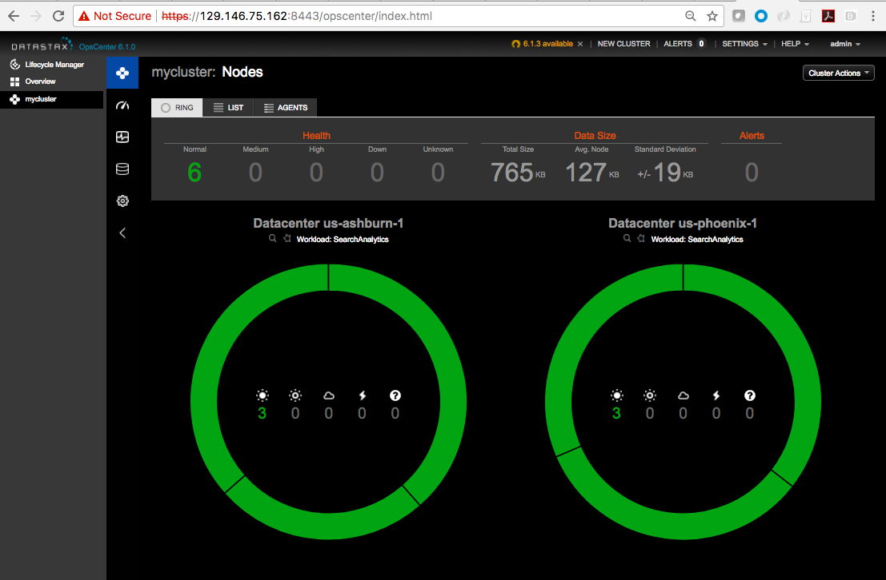
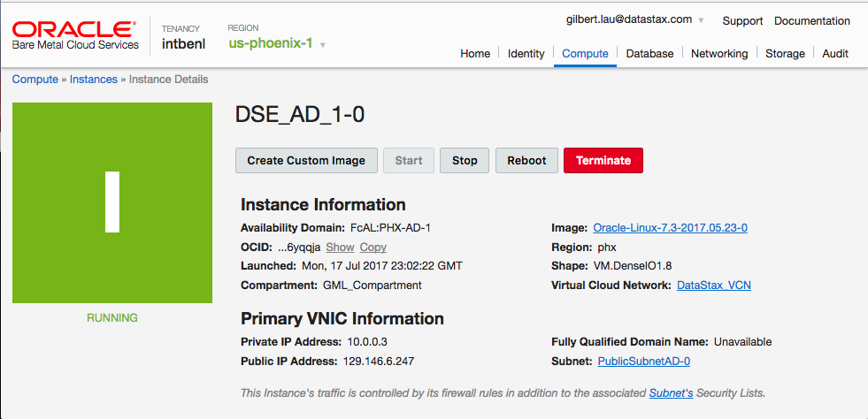

# oci-terraform-dse/simple
This Terraform module deploys a DataStax Enterprise (DSE) cluster to Oracle Cloud Infrastructure (OCI).

## Install Terraform and the OCI Provider
First off, we need to install Terraform.  Instructions on that are [here](https://www.terraform.io/intro/getting-started/install.html).  You can test that Terraform is properly installed by running `terraform`:

Next you're going to need to install the [Terraform Provider for Oracle Cloud Infrastructure](https://github.com/oracle/terraform-provider-baremetal/blob/master/README.md).  I'm on a Mac, so I downloaded a copy of the binary, `darwin_amd64.tar.gz` from [here](https://github.com/oracle/terraform-provider-oci/releases) and put it in a new plugins directory.  To do that, I ran the follow commands on my Mac:

    tar -xvf darwin_amd64.tar.gz
    cd ~/.terraform.d
    mkdir plugins
    cd plugins
    mv ~/Downloads/darwin_amd64/terraform-provider-oci_v2.2.0 ./
    ls

That gave this output:

## Clone the Module
Now, you'll want a local copy of this repo.  You can make that with the commands:

    git clone https://github.com/benofben/oci-terraform-dse.git
    cd oci-terraform-dse/simple
    ls

With the provider installed and the repo cloned, we now need to initialize the directory with the module in it.  This makes the module aware of the provider.  You can do this by running:

    terraform init

This gives the following output:

## Setup Keys and Environment Variables
* [Set up your OCI's fingerprint for OCI APIs access](https://docs.us-phoenix-1.oraclecloud.com/Content/API/Concepts/apisigningkey.htm)
* [Set up SSH key pair for your OCI BM or VM instances](https://docs.us-phoenix-1.oraclecloud.com/Content/GSG/Tasks/creatingkeys.htm)
* Created an OCI API Signing Key Pair under ~/.oraclebmc directory.
* Uploaded the public key from the above pair to OCI to generate the key's fingerprint.
* Created an SSH key pair to be used instead of a password to authenticate a remote user under your ~/.ssh directory.

Update the `env-vars.sh` file:

From your OCI account:
* TF_VAR_tenancy_ocid
* TF_VAR_user_ocid
* TF_VAR_fingerprint
* TF_VAR_private_key_path

From your local file system:
* TF_VAR_ssh_public_key
* TF_VAR_ssh_private_key

Now run the script to set those variables:

    env-vars.sh

## Deploy
Update `\<ssh_private_key_path\>` field in `remote-exec.tf` with the absolute path of your SSH private key. For example, `/Users/gilbertlau/.ssh/bmc_rsa`

You can test the deployment by running:

    terraform plan

If everything looks good, you can run it for real with the command:

    terraform apply

Assuming everything works, you'll see something like this:

The time taken to deploy the default DSE cluster configuration is roughly 20 minutes long. Once complete, you can point your web browser to `https://<OpsCenter_URL>` and log into OpsCenter using `admin` as Username and the value of OpsCenter_Admin_Password as the Password. The OpsCenter instance uses a self-signed SSL certificate, so you will need to accept the certificate exception before you can see the OpsCenter's login page.

You can SSH into the any of the DSE nodes using this command:

    ssh -i <path to your SSH private key> opc@<IP address of a DSE node>

The IP address of your DSE node in OCI Console is under Compute >> Instances >> Instance Details.

You can cqlsh into your DSE nodes using

    cqlsh <IP address of a DSE node> \
      -u cassandra \
      -p <Cassandra_DB_User_Password>

## Destroy the Deployment
When you no longer need the DSE cluster, you can run this to delete the deployment:

    terraform destroy
